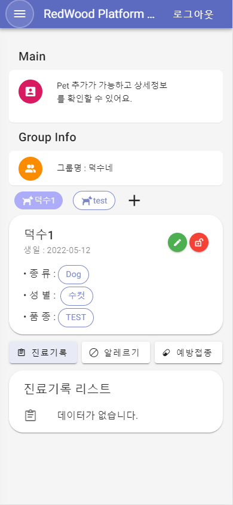
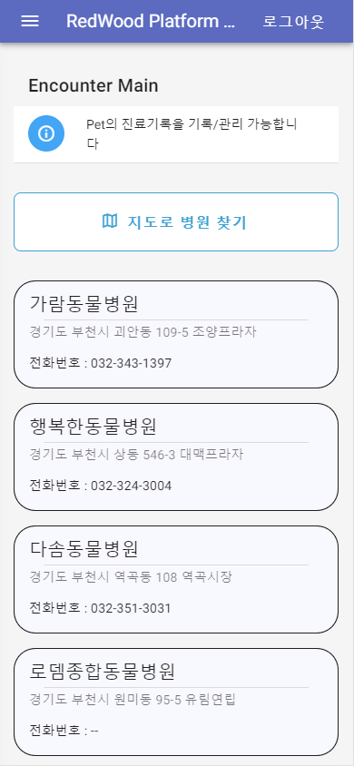
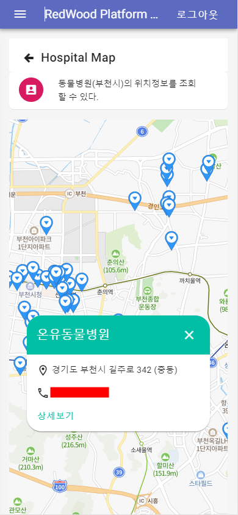
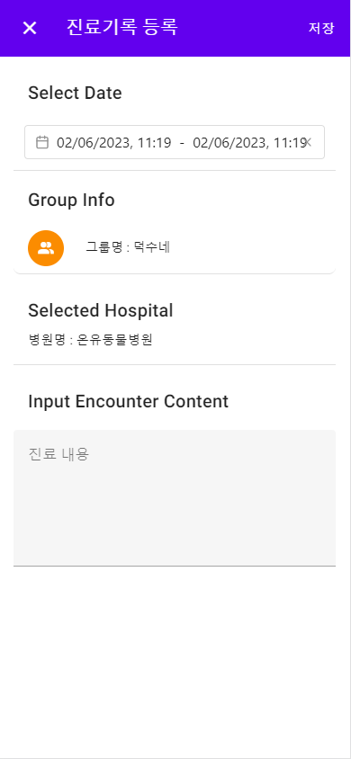
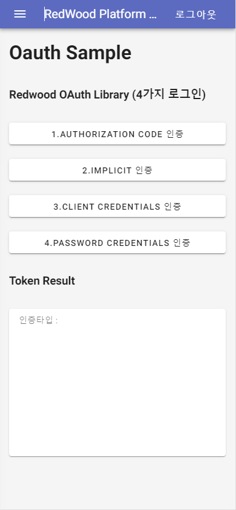

 Demo Web Preiview 

  

<!-- ABOUT THE PROJECT -->
## 📖 About The Project

플랫폼(Redwood Platform)을 테스트 하기 위한 웹 서비스로 플랫폼의 SDK ['Fhir sdk', 'Oauth sdk', openApi sdk']를 활용하여, 로그인, 회원가입, Oauth, 건강정보 CRUD 및 통계를 구현했습니다. 이를 통해, 반려동물 건강 정보 기록 및 공유 할수 있고 공공데이터[부천시의 동물병원]를 통해 병원 위치정보와  해당 병원의 진료기록을 저장, 조회 할 수 있습니다.

## 📸 Screen Shot

 
 
 
  
 
 

## 🧑‍💻 Built With

해당 프로젝트를 구성한 Tech Skill List입니다.

 | Category                                                   | Stack                                                   |
| ------------------------------------------------------------ | ------------------------------------------------------- |
| **Frontend**                 | Vue3, JavaScript |
| **UI Framework**             | Vuetify3.0  |
| **Deployment**               | Netlify, Heroku  |
| **Open Data**             | 전국 동물 병원 요약 정보[공공 데이터] |
| **Open API**             | Redwood Platform , Naver Map |

## 🚩 Update

➡ <b>(2023-01-15) : 동물 병원에 반려동물 진료기록 등록 및 조회</b>  
➡ <b>(2023-01-02) : Naver Map으로 부천시 동물 병원 표시</b>  
➡ <b>(2022-12-21) : 반려동물 정보 등록 및 조회 </b>  
➡ <b>(2022-12-13) : Naver Map API 테스트 </b>  
➡ <b>(2022-12-11) : sdk 적용 및 테스트 </b>  

